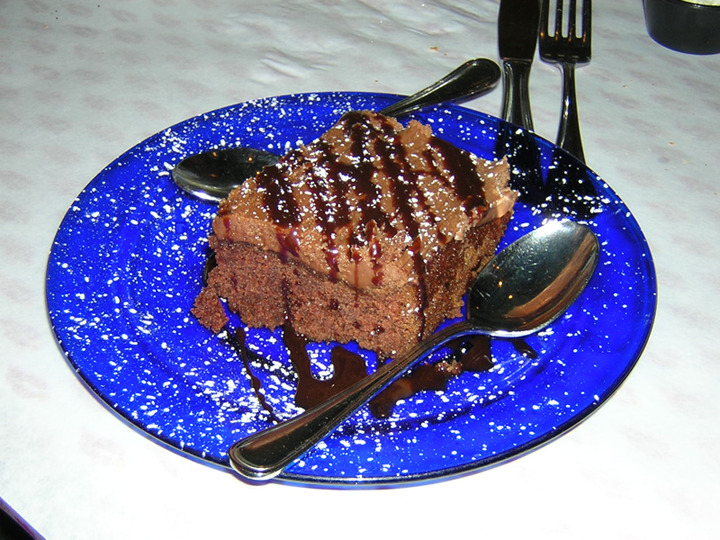
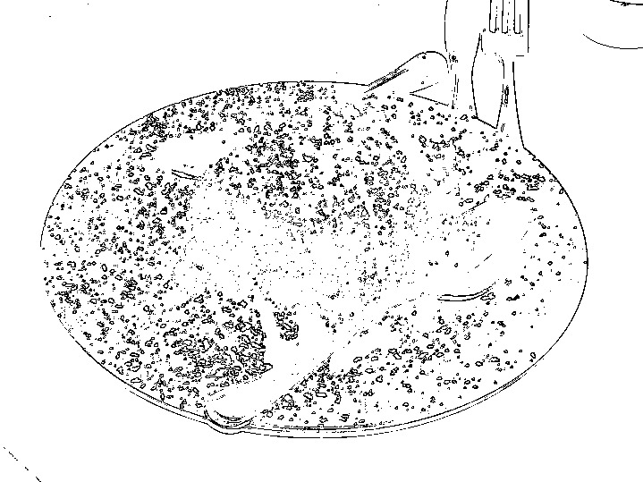
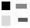

<a name="readme-top"></a>


<!-- PROJECT SHIELDS -->
<!--
*** https://www.markdownguide.org/basic-syntax/#reference-style-links
-->
[![Contributors][contributors-shield]][contributors-url]
[![Forks][forks-shield]][forks-url]
[![Stargazers][stars-shield]][stars-url]
[![Issues][issues-shield]][issues-url]
[![LinkedIn][linkedin-shield]][linkedin-url]


<!-- PROJECT LOGO -->
<br />
<div align="center">

<h3 align="center">PPM Image Processor</h3>

  <p align="center">
    A tool to perform various transformations on images in the .ppm format. 
    <br />
    <br />
    <a href="https://github.com/gradyl16/PPM.Processor/issues">Report Bug</a>
    ·
    <a href="https://github.com/gradyl16/PPM.Processor/issues">Request Feature</a>
  </p>
</div>


<!-- TABLE OF CONTENTS -->
<details>
  <summary>Table of Contents</summary>
  <ol>
    <li>
      <a href="#about-the-project">About The Project</a>
    </li>
    <li>
      <a href="#getting-started">Getting Started</a>
      <ul>
        <li><a href="#prerequisites">Prerequisites</a></li>
        <li><a href="#installation">Installation</a></li>
      </ul>
    </li>
    <li><a href="#usage">Usage</a></li>
    <li><a href="#roadmap">Roadmap</a></li>
    <li><a href="#contributing">Contributing</a></li>
    <li><a href="#contact">Contact</a></li>
  </ol>
</details>


<!-- ABOUT THE PROJECT -->
## About The Project

This project offers a few ways to transform images. Below are some clarifications on the less obvious operations:

- Threshold

  - Thresholding increases image separation --- dark values become darker and light values become
lighter. Given a threshold value in the range 0 < threshold < color depth, any RGB value > threshold is
set to the color depth (e.g. 255), while any RGB value <= threshold is set to 0.

- Edge detection

  - Edge detection is an algorithm used in computer vision to help distinguish different objects in a picture or to distinguish an object in the foreground of the picture from the background. Edge Detection replaces each pixel in the original image with a black pixel, (0, 0, 0), if the original pixel contains an "edge" in the original image. If the original pixel does not contain an edge, the pixel is replaced with a white pixel (255, 255, 255).

The transformations are done in a provably correct way due to the usage of functional programming. This project was built with F# and the .NET framework, created by Microsoft.

This project was developed as part of the curriculum for Programming Language Design & Implementation during the fall 2023 semester.

### Background

The `.ppm` image format is a human-readable format which has the following basic format:

```
[MAGIC NUMBER]
[INTEGER WIDTH] [INTEGER HEIGHT]
[MAX COLOR DEPTH (0<=max<=65536)]
[R G B] [R G B]...
[R G B]
...
```

Note that this syntax may not be the most accurate depiction. For more detailed information, visit the [documentation](https://netpbm.sourceforge.net/doc/ppm.html).


<p align="right">(<a href="#readme-top">back to top</a>)</p>


<!-- GETTING STARTED -->
## Getting Started

To get a local copy up and running follow these steps.

### Prerequisites

Refer to the [official documentation](https://github.com/dotnet/core/blob/main/release-notes/7.0/install.md) to install .NET 7.0 SDK.

### Installation

Clone the repo:

```sh
git clone https://github.com/gradyl16/PPM.Processor.git
```

<p align="right">(<a href="#readme-top">back to top</a>)</p>


<!-- USAGE EXAMPLES -->
## Usage

To run your local instance of the project, do the following (starting from the repo's root directory):

```sh
cd src/PPM.Processor.App
dotnet run
```

Once the program has started, specify the path to the file that you wish to transform. Note that there are sample files located in `src/PPM.Processor.App/sample`. For example:

```
Image filename> sample/cake.ppm
```

You will then be prompted for an integer to select the transformation you wish to perform. Some operations may ask for additional input. For example:

```
Operation?
  1 => grayscale
  2 => threshold
  3 => flip horizontal
  4 => edge detect
  5 => right-rotate 90
> 4

Edge threshold value (0 < value < 255)? 100
Running edge detection...
Writing 'output/cake-edge.ppm'...

Done
```

Observe that each execution of the program completes exactly one transformation on one image. To complete additional transformations, rerun the program with `dotnet run`.

### PPM Reader

Note that this project is shipped with a `.ppm` interpreter. If you do not wish to convert your images to a more common format for viewing, you can spin up a local server with `ppmReader.html` to view the file.

### Example Images

Below are some before and after images created from files located in the `src/PPM.Processor.App/sample` directory.

**Transformation on `cake.ppm` with edge detect threshold = 100:**

<div>
  
  
</div>

<br>

**Transformation on `blocks.ppm` with grayscale:**

<div>
  
  
</div>

<p align="right">(<a href="#readme-top">back to top</a>)</p>


<!-- ROADMAP -->
## Roadmap

- [ ] Grayscale
- [ ] Threshold
- [ ] Horizontal flip
- [ ] Edge detection
- [ ] 90 degree clockwise rotation

See the [open issues](https://github.com/gradyl16/PPM.Processor/issues) for a full list of proposed features (and known issues).

<p align="right">(<a href="#readme-top">back to top</a>)</p>


<!-- CONTRIBUTING -->
## Contributing

Contributions are what make the open source community such an amazing place to learn, inspire, and create. Any contributions you make are **greatly appreciated**.

If you have a suggestion that would make this better, please fork the repo and create a pull request. You can also simply open an issue with the tag "enhancement".
Don't forget to give the project a star! Thanks again!

1. Fork the Project
2. Create your Feature Branch (`git checkout -b feature/AmazingFeature`)
3. Commit your Changes (`git commit -m 'Add some AmazingFeature'`)
4. Push to the Branch (`git push origin feature/AmazingFeature`)
5. Open a Pull Request

<p align="right">(<a href="#readme-top">back to top</a>)</p>


<!-- CONTACT -->
## Contact

Dylen Greenenwald -  dgree21@uic.edu

Project Link: [https://github.com/gradyl16/PPM.Processor](https://github.com/gradyl16/PPM.Processor)

<p align="right">(<a href="#readme-top">back to top</a>)</p>


<!-- MARKDOWN LINKS & IMAGES -->
<!-- https://www.markdownguide.org/basic-syntax/#reference-style-links -->
[contributors-shield]: https://img.shields.io/github/contributors/gradyl16/PPM.Processor.svg?style=for-the-badge
[contributors-url]: https://github.com/gradyl16/PPM.Processor/graphs/contributors
[forks-shield]: https://img.shields.io/github/forks/gradyl16/PPM.Processor.svg?style=for-the-badge
[forks-url]: https://github.com/gradyl16/PPM.Processor/network/members
[stars-shield]: https://img.shields.io/github/stars/gradyl16/PPM.Processor.svg?style=for-the-badge
[stars-url]: https://github.com/gradyl16/PPM.Processor/stargazers
[issues-shield]: https://img.shields.io/github/issues/gradyl16/PPM.Processor.svg?style=for-the-badge
[issues-url]: https://github.com/gradyl16/PPM.Processor/issues
[license-shield]: https://img.shields.io/github/license/gradyl16/PPM.Processor.svg?style=for-the-badge
[license-url]: https://github.com/gradyl16/PPM.Processor/blob/master/LICENSE.txt
[linkedin-shield]: https://img.shields.io/badge/-LinkedIn-black.svg?style=for-the-badge&logo=linkedin&colorB=555
[linkedin-url]: https://linkedin.com/in/gradyl16
[product-screenshot]: images/screenshot.png
[Next.js]: https://img.shields.io/badge/next.js-000000?style=for-the-badge&logo=nextdotjs&logoColor=white
[Next-url]: https://nextjs.org/
[React.js]: https://img.shields.io/badge/React-20232A?style=for-the-badge&logo=react&logoColor=61DAFB
[React-url]: https://reactjs.org/
[Vue.js]: https://img.shields.io/badge/Vue.js-35495E?style=for-the-badge&logo=vuedotjs&logoColor=4FC08D
[Vue-url]: https://vuejs.org/
[Angular.io]: https://img.shields.io/badge/Angular-DD0031?style=for-the-badge&logo=angular&logoColor=white
[Angular-url]: https://angular.io/
[Svelte.dev]: https://img.shields.io/badge/Svelte-4A4A55?style=for-the-badge&logo=svelte&logoColor=FF3E00
[Svelte-url]: https://svelte.dev/
[Laravel.com]: https://img.shields.io/badge/Laravel-FF2D20?style=for-the-badge&logo=laravel&logoColor=white
[Laravel-url]: https://laravel.com
[Bootstrap.com]: https://img.shields.io/badge/Bootstrap-563D7C?style=for-the-badge&logo=bootstrap&logoColor=white
[Bootstrap-url]: https://getbootstrap.com
[JQuery.com]: https://img.shields.io/badge/jQuery-0769AD?style=for-the-badge&logo=jquery&logoColor=white
[JQuery-url]: https://jquery.com 
